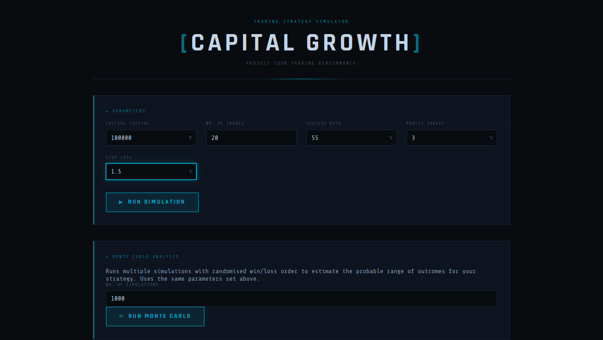

# trade-analyze — Trading Strategy Capital Growth Simulator

[](https://opensource.org/licenses/MIT)
[](https://www.typescriptlang.org/)
[](https://react.dev/)
[](https://vite.dev/)

> A dark-themed, terminal-aesthetic trading strategy simulator that projects capital growth, P&L, and outcome probability across configurable trade sequences — with both deterministic and Monte Carlo analysis modes.



[Live Demo](https://trade-analyze-o4xb.vercel.app/) • [Report Bug](https://github.com/Sid2169/trade-analyze/issues) • [Request Feature](https://github.com/Sid2169/trade-analyze/issues)


---

---

## 📋 Table of Contents

- [Overview](#-overview)
- [Features](#-features)
- [Getting Started](#-getting-started)
- [Usage Guide](#-usage-guide)
- [Technical Implementation](#-technical-implementation)
- [Future Enhancements](#-future-enhancements)
- [Contributing](#-contributing)
- [License](#-license)

---

## 🎯 Overview

**trade-analyze** helps traders evaluate the projected performance of a rule-based strategy before risking real capital. Enter your strategy parameters once and instantly see a trade-by-trade breakdown of capital growth alongside a probabilistic Monte Carlo analysis of outcome distributions.

### Why trade-analyze?

- **📊 Two Simulation Modes**: Deterministic trade log and randomised Monte Carlo analysis
- **🔢 Compounding by Default**: Each trade's result becomes the next trade's starting capital
- **🎨 Visual P&L Encoding**: Green/red row colouring and glow effects make wins and losses instantly readable
- **⚡ Zero Backend**: Runs entirely in the browser — no server, no data sent anywhere
- **🖥️ Terminal Aesthetic**: Dark theme with monospace fonts and scanline overlay for a focused, distraction-free experience

---

## ✨ Features

### Deterministic Simulation

- Input five strategy parameters: initial capital, number of trades, success rate, profit target %, and stop loss %
- Generates a trade-by-trade log using an evenly-distributed win/loss sequence derived from the success rate
- Each row shows: serial number, capital before trade, P&L (amount + %), capital after trade, WIN/LOSS badge
- Summary bar displays final capital, net P&L with percentage, win/loss count, and risk-to-reward ratio
- Profit rows styled in green, loss rows in red, with glowing text accents

### Monte Carlo Analysis

- Takes an additional input: number of simulations (1–100,000)
- Each simulation independently randomises win/loss order using `Math.random()` against the success rate
- Aggregates results across all runs — no per-trade detail shown
- Displays: average final capital, average net P&L, best outcome, worst outcome, and percentage of profitable simulations
- Animated fill bar visualises the profitable-simulation percentage at a glance

### UI & Design

- Dark terminal theme using **Share Tech Mono** and **Rajdhani** fonts
- CSS scanline overlay for atmosphere
- Smooth scroll-to-results after each run
- Fully responsive — collapses gracefully on mobile
- Purple accent colour distinguishes the Monte Carlo section from the deterministic section

---

## 🚀 Getting Started

### Prerequisites

- Node.js `^20.19.0` or `>=22.12.0`
- npm

### Installation

```bash
# Clone the repository
git clone https://github.com/your-username/trade-analyze.git
cd trade-analyze

# Install dependencies
npm install

# Start the development server
npm run dev
```

Then open [http://localhost:5173](http://localhost:5173) in your browser.

### Build for Production

```bash
npm run build
npm run preview
```

---

## 📖 Usage Guide

### Running a Deterministic Simulation

1. Fill in the five **Parameters** inputs:
   - **Initial Capital** — the amount you start with (₹)
   - **No. of Trades** — how many trades to simulate
   - **Success Rate** — percentage of trades that are winners
   - **Profit Target** — profit as a percentage of capital on a winning trade
   - **Stop Loss** — loss as a percentage of capital on a losing trade
2. Click **▶ RUN SIMULATION**
3. A summary bar and full trade log appear below, colour-coded by outcome

### Running a Monte Carlo Analysis

The Monte Carlo section uses the same five parameters set above — no need to re-enter them.

1. Enter **No. of Simulations** (e.g. `1000`)
2. Click **⟳ RUN MONTE CARLO**
3. Results show the averaged and extreme outcomes across all runs

> **Note:** The deterministic simulation always produces the same sequence for given inputs (wins are spread evenly). The Monte Carlo shuffles win/loss order randomly each run, revealing how much sequence variance affects your real-world results.

---

## 🏗️ Technical Implementation

### Architecture

Single-page React application with no routing or global state library. All simulation logic is pure TypeScript functions; React state manages inputs and results.

```
src/
├── App.tsx          # All components and simulation logic
├── App.css          # Terminal-theme styles
└── index.css        # Root reset and body background
```

### Key Functions

#### `simulateTrades()`

Deterministic simulation using a round-robin win/loss spread:

```typescript
// Distributes wins evenly across the sequence using floating-point accumulation
const threshold = (i * successRate) % 1
const nextThreshold = ((i + 1) * successRate) % 1
const isProfit = nextThreshold < threshold || nextThreshold === 0
```

Each trade compounds on the previous result:
```typescript
const capitalAfter = capitalBefore + profitOrLoss
capital = capitalAfter
```

#### `runMonteCarlo()`

Runs N independent simulations with randomised outcomes:

```typescript
for (let s = 0; s < numSimulations; s++) {
  let capital = initialCapital
  for (let t = 0; t < numTrades; t++) {
    const isProfit = Math.random() < successRate
    capital += isProfit
      ? capital * (profitPct / 100)
      : -capital * (stopLossPct / 100)
  }
  finalCapitals.push(capital)
}
```

Aggregated results include mean, best, worst, and the fraction of runs that ended above starting capital.

### Design Decisions

#### Deterministic Win Distribution

Rather than using `Math.random()` for the trade log, wins are distributed evenly using a floating-point accumulation approach. This makes the single simulation reproducible and representative of the expected success rate — useful for understanding the strategy's theoretical behaviour.

#### Separate Modes for Separate Questions

The deterministic log answers *"what does my strategy look like trade by trade at exactly my success rate?"* The Monte Carlo answers *"what range of outcomes should I expect given random sequencing?"* Keeping them as distinct sections with separate run controls makes the distinction clear.

#### No External Charting Library

Results are presented as a table and stat cards rather than charts, keeping the bundle lean and the data readable without requiring an additional dependency.

---

## 🚧 Future Enhancements

- [ ] **Equity Curve Chart**: Visualise capital growth over trades
- [ ] **Monte Carlo Distribution Histogram**: Show the spread of final capital outcomes
- [ ] **CSV Export**: Download the trade log as a spreadsheet
- [ ] **Multiple Strategies**: Compare two strategies side by side
- [ ] **Drawdown Metrics**: Max drawdown and recovery factor
- [ ] **Streak Analysis**: Longest win/loss streak in the deterministic log
- [ ] **Keyboard Shortcuts**: `Enter` to run simulation from any input field
- [ ] **Dark/Light Theme Toggle**

---

## 🤝 Contributing

1. Fork the repository
2. Create a feature branch: `git checkout -b feat/your-feature`
3. Commit your changes using [Conventional Commits](https://www.conventionalcommits.org/)
4. Push and open a Pull Request

Please ensure `npm run lint` passes before submitting.

---

## 📄 License

This project is licensed under the **MIT License** — see the LICENSE file for details.

---

## ⚠️ Disclaimer

This tool is for **educational and illustrative purposes only**. Simulated results do not guarantee future trading performance. Past strategy parameters do not predict future market behaviour.

---

<div align="center">

**Built with React + TypeScript + Vite**

If this helped you think more clearly about your strategy, consider giving it a ⭐

</div>